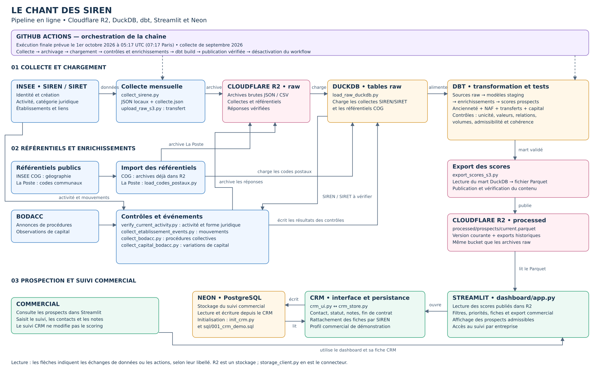

# Le Chant des SIREN — Prospection B2B

Un outil de prospection pour une agence de communication qui rend les offres technologiques compréhensibles : identification de sociétés, priorisation explicable et suivi commercial.

[Ouvrir le dashboard](https://prospection-b2b-jly47kskqkwibutp3afd43.streamlit.app/)

## État du projet

- Stockage migré d’AWS S3 vers **Cloudflare R2** : 3 900 objets, environ 325 Mo, vérifiés lors de la migration.
- Dernier volume communiqué avant l’actualisation finale : **20 572 établissements**. Ce volume décrit un état de la base, pas une constante du programme.
- Streamlit lit les résultats publiés dans R2 ; le suivi commercial est conservé dans **Neon PostgreSQL**.
- Une dernière actualisation est prévue le **1er octobre 2026 à 05:17 UTC**, pour septembre 2026. Le workflow comporte un contrôle de date, un marqueur de publication et une étape de désactivation. Sa réussite reste à vérifier dans GitHub Actions.
- Le projet est un démonstrateur. Le profil CRM est partagé et non authentifié : contacts et notes fictifs uniquement.

## Architecture



| Élément | Rôle et choix |
| --- | --- |
| Python | Collecte des API, pagination, contrôles, archivage et export |
| INSEE — données SIREN/SIRET | Identité, création, activité, catégorie juridique, établissements et liens |
| COG INSEE | Communes, départements et régions |
| La Poste | Correspondance entre code commune INSEE et codes postaux possibles |
| BODACC | Procédures collectives et observations de variations de capital |
| Cloudflare R2 | Stockage objet des archives et du Parquet publié, via une API compatible S3 |
| DuckDB | Entrepôt analytique local au processus, adapté au volume et aux transformations SQL |
| dbt Core + dbt-duckdb | Modèles SQL, dépendances, documentation et tests de qualité |
| Parquet | Fichier compact de résultats consommé par l’application |
| Streamlit | Tableau de bord, filtres, fiches entreprise et interface CRM |
| Neon PostgreSQL | Persistance des saisies commerciales, indépendante des recalculs analytiques |
| GitHub Actions | Orchestration de la dernière actualisation |

Les noms de fichiers `upload_raw_s3.py` et `export_scores_s3.py`, ainsi que la valeur `DATA_SOURCE=s3`, désignent encore le protocole compatible S3. Le stockage utilisé est **R2**, via `dashboard/storage_client.py`.

## Parcours des données

1. `collect_sirene.py` collecte les établissements et conserve les pages JSON et le suivi de collecte localement.
2. `upload_raw_s3.py` transfère les fichiers bruts dans R2 et vérifie leur contenu.
3. `load_raw_duckdb.py` relit les collectes terminées dans R2 et charge les tables `raw` ainsi que les référentiels COG.
4. `load_codes_postaux.py` charge le référentiel postal. Les scripts de vérification d’activité, BODACC, mouvements et capital enrichissent les tables `raw` et archivent les réponses dans R2.
5. `dbt build` construit les modèles de préparation, les enrichissements et `analytics.mart_prospects_scores`, puis exécute les tests associés.
6. `export_scores_s3.py` publie un export historique et `processed/prospects/current.parquet`, avec vérification du contenu.
7. Streamlit lit ce Parquet et applique les règles d’affichage commercial. Le CRM lit et écrit dans Neon, avec rattachement par **SIREN**.

Les objets `raw/` et `processed/` sont deux préfixes d’un même bucket R2. Les collecteurs complémentaires écrivent directement leurs résultats dans DuckDB : leur archivage n’est pas leur unique sortie.

## Périmètre et règles commerciales

Périmètre initial : établissements sièges en Île-de-France, activités `58.29C`, `62.02A` et `62.01Z`. La base peut conserver des entreprises devenues hors périmètre d’âge ; elles n’ont plus de score V1.

### Score v1.2

| Critère | Points |
| --- | ---: |
| Moins de 3 mois — Babies | 100 |
| De 3 mois inclus à moins de 9 mois — Newbies | 50 |
| De 9 mois inclus à moins de 12 mois — Premiers pas | 100 |
| 12 mois ou plus | Score nul, hors périmètre V1 |
| NAF 58.29C — édition de logiciels applicatifs | +30 |
| NAF 62.02A — conseil en systèmes et logiciels informatiques | +20 |
| NAF 62.01Z — programmation informatique | +10 |
| Premier transfert admissible dans la fenêtre de 12 mois | +50 |
| Chaque transfert admissible supplémentaire | +25 |
| Première hausse de capital admissible dans la fenêtre de 12 mois | +50 |
| Chaque hausse admissible supplémentaire | +25 |
| Chaque baisse admissible de capital | −25 |

Les bornes d’âge sont des mois calendaires. Les événements sont postérieurs à la création. Le capital est évalué selon la **date de publication BODACC**, qui n’établit pas la date juridique effective de l’opération. Les contrôles de montant, devise, chronologie, doublons et ambiguïtés déterminent les observations admissibles.

Le score total additionne ancienneté, NAF, transferts et capital. Il n’est pas plafonné à 100. **Vert dès 81 points ; orange jusqu’à 80 points inclus.** Un score nul n’est pas un score zéro.

L’activité confirmée et l’absence de procédure repérée déterminent l’admissibilité, sans attribuer de points. Les entreprises non admissibles et les noms ND/NR sont exclus de la vue commerciale. La catégorie juridique sert à qualifier et filtrer, pas à présumer un budget. Les ouvertures potentielles non confirmées ne donnent pas de bonus dans cette version.

Les codes postaux de commune peuvent contenir plusieurs possibilités : ils ne prouvent pas l’adresse exacte d’un établissement. Le score est une règle métier exploratoire, pas une probabilité de conversion. Aucune donnée de chiffre d’affaires générée n’entre dans le score de production.

## Installation locale

Depuis la racine du dépôt, dans un environnement Python dédié. Le workflow utilise Python 3.12 ; les versions des dépendances sont définies dans les fichiers requirements.

```bash
python -m pip install -r requirements-pipeline.txt
python -m pip install -r dashboard/requirements.txt
```

Les données, la base DuckDB et les secrets ne sont pas versionnés. Cloner le dépôt ne suffit donc pas à reconstruire les données.

### Configuration

Renseigner `.env` localement, les secrets GitHub Actions pour le pipeline et les secrets Streamlit pour l’application.

| Variable | Utilisation |
| --- | --- |
| `INSEE_API_KEY` | Collecte et contrôles INSEE |
| `R2_ENDPOINT_URL` | Endpoint HTTPS S3 Cloudflare, sans bucket ni paramètres |
| `R2_ACCESS_KEY_ID`, `R2_SECRET_ACCESS_KEY` | Accès R2 : lecture/écriture pour le pipeline, lecture seule pour Streamlit |
| `R2_BUCKET_NAME` | Bucket du projet : `prospection-b2b` |
| `DATA_SOURCE` | `local` pour DuckDB, `s3` pour R2 |
| `S3_SCORES_KEY` | `processed/prospects/current.parquet` |
| `DUCKDB_PATH` | Chemin de la base `prospection.duckdb` pour les scripts et le profil dbt de déploiement |
| `CRM_DATABASE_URL` | Connexion PostgreSQL Neon du CRM |

Ne pas committer `.env`, `secrets.toml`, mots de passe ou clés. Le profil dbt local existant contient un chemin propre au Mac de l’autrice ; l’adapter sur une autre machine ou utiliser le profil `deployment/dbt` avec `DUCKDB_PATH`.

### Consulter l’application

```bash
DATA_SOURCE=s3 python -m streamlit run dashboard/app.py
```

Pour utiliser une base locale déjà construite :

```bash
DATA_SOURCE=local python -m streamlit run dashboard/app.py
```

Initialiser le CRM uniquement si nécessaire, après configuration de Neon :

```bash
python init_crm.py
```

### Vérifier et documenter

```bash
python check_r2.py
python -m unittest discover -s tests -p 'test_*.py'
```

`check_r2.py` vérifie le Parquet publié et la présence des référentiels, sans lancer de collecte. Les tests Python ne remplacent pas les tests dbt sur la base réelle.

Pour reconstruire les modèles sur une base raw déjà complète, fixer la date d’évaluation souhaitée :

```bash
dbt build --project-dir dbt_prospection --profiles-dir dbt_prospection --vars '{"date_evaluation":"2026-10-01"}'
```

Cette commande modifie les modèles locaux ; elle ne publie pas automatiquement les résultats dans R2.

## Documentation dbt

Voir [le guide dbt Docs](docs/DBT_DOCS.md). Les descriptions et tests sont dans les YAML du projet. La page d’accueil et la dépendance du dashboard sont ajoutées dans `dbt_prospection/models/documentation/`.

dbt Docs décrit le périmètre dbt. Les collecteurs Python, les transferts R2 et le CRM Neon sont documentés dans ce README et le diagramme d’architecture.

## Qualité et limites

- Tests génériques : `not_null`, `unique`, `accepted_values`, `relationships`, selon les colonnes.
- Tests SQL spécifiques : cohérence du score, conservation des volumes après enrichissement, affichage, activité actuelle et admissibilité BODACC.
- Les archives et contrôles conservent la traçabilité des collectes et observations.
- Un contrôle BODACC sans procédure repérée n’est pas une certification juridique de l’entreprise.
- Une donnée absente ou ambiguë n’est pas une preuve d’absence d’événement.
- Après l’arrêt des collectes, les informations reflètent la dernière vérification, pas la situation en temps réel.

## Organisation du dépôt

| Chemin | Contenu |
| --- | --- |
| `collect_*.py`, `verify_current_activity.py` | Collectes et contrôles complémentaires |
| `load_*.py`, `upload_raw_s3.py`, `export_scores_s3.py` | Chargements et transferts |
| `dbt_prospection/models/` | Sources, staging, référentiels, intermédiaires, mart et documentation |
| `dbt_prospection/tests/` | Tests SQL métier |
| `dashboard/` | Application, CRM et connecteur R2 |
| `sql/001_crm_demo.sql` | Schéma du CRM |
| `tests/` | Tests Python |
| `.github/workflows/monthly-data.yml` | Actualisation finale du 1er octobre 2026 |
| `one_off_update.py` | Garde de date et marqueur de publication |
| `docs/` | Guide dbt Docs et diagramme |

Autrice : Céline Maussang. Documentation préparée sur la version du dépôt fournie le 29 septembre 2026.
